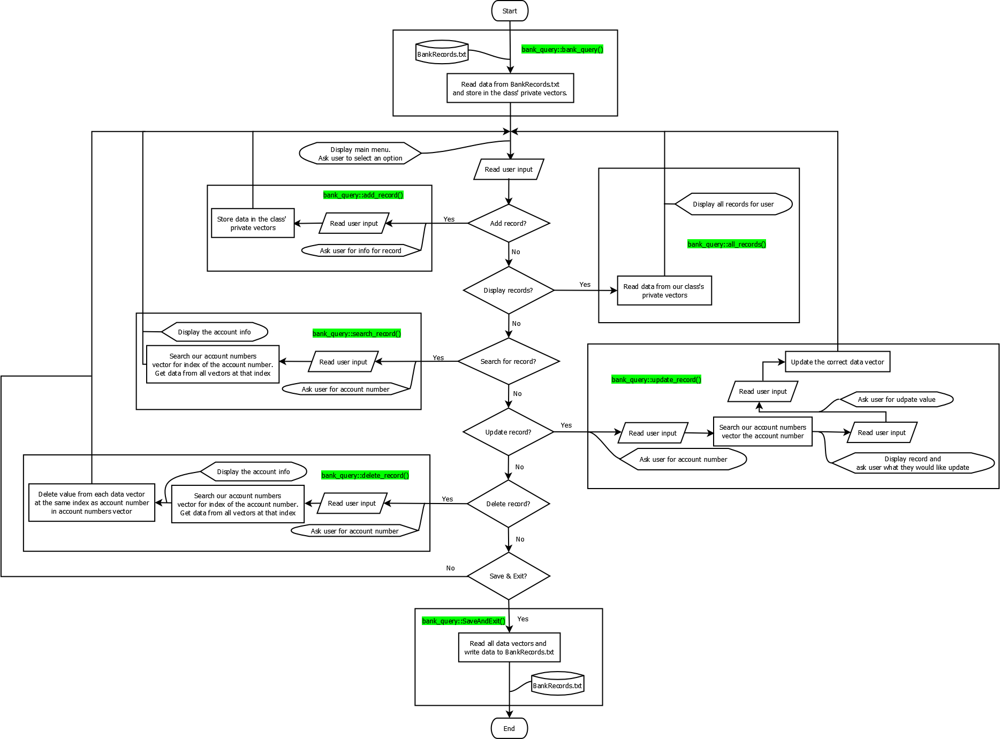

# Simple Banking System
This project is a simple console application made with C++. The purpose of this project was to 
introduce myself to the C++ programming language, working with classes, user and file I/O.

## Circuit Schematic
