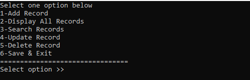
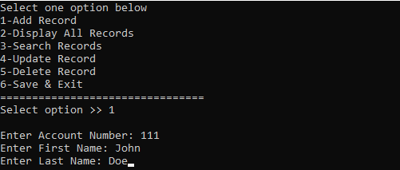
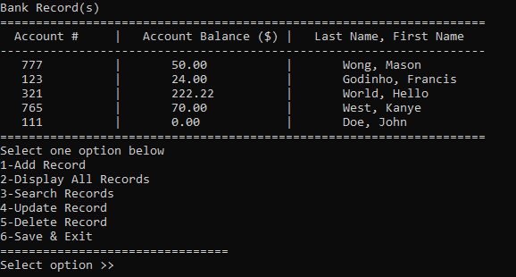
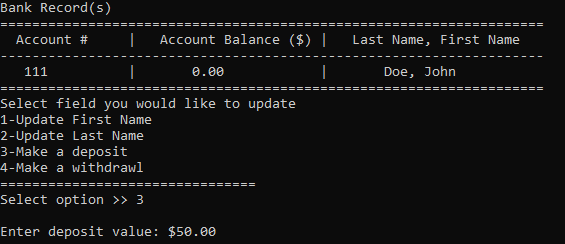
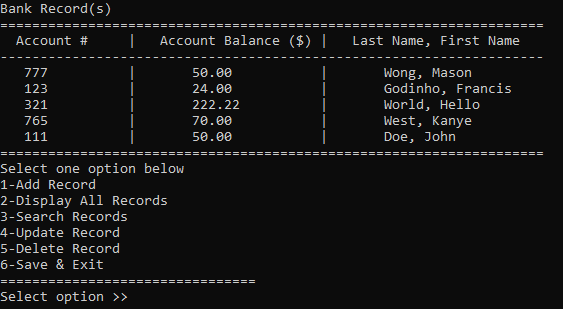

# Simple Banking System
This project is a simple console application made with C++. The purpose of this project was to 
introduce myself to the C++ programming language, working with classes, user and file I/O.

## Flowchart
This flowchart describes the operation of the banking system:

## Screenshots

### Main Menu
When first starting the program the user will be prompted by a main menu screen which gives them options for what they would like
to do:

### Add Record
If the user chooses to add a new record they will be asked for information for the account they will be opening:

### Display Records
After the user has added the new record, they will go back to the main menu where they can do a command to view all the records.
This is what it looks like when the user views all the records, you can see that the new record has been added to our record list:

### Update Record
In the main menu the user also has an option to update a record. For this they will be asked to enter an account number and then the account 
will information will appear on the console. They will then be asked what data field they would like to update as well as the new value they 
would like to save. Here the user is making a $50.00 deposit into acount number '111':

### Display Updated Records
Here you can see if we display the records again from the main menu that the account balance for account number '111' has increased by $50.00:

### Save & Exit
When we save & exit from the main menu all the changes we have made will be saved into a text file. This text file is open and read
when we first start the program to initialize the data vectors for our bank_query class:

